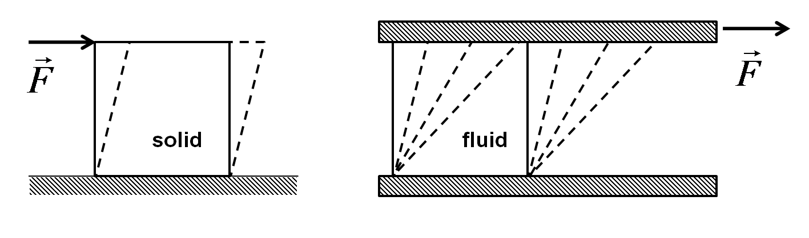

.. _`sec:basics`:

Basics
======

This book is a primer on aerodynamics, covering topics found in AE 325.
For more in-depth content, three particularly good resources are John D.
Anderson's `*Fundamentals of Aerodynamics* textbook <https://www.mheducation.com/highered/product/fundamentals-of-aerodynamics-anderson.html?viewOption=student/>`_,
Mark Drela's `MIT Fluid Mechanics Course <https://ocw.mit.edu/courses/16-01-unified-engineering-i-ii-iii-iv-fall-2005-spring-2006/pages/fluid-mechanics//>`_ , and
Professor Fidkowski's AE 325 Notes.

.. _`sec:what_is_aero`:

What is aerodynamics?
---------------------

Aerospace engineers design vehicles that move through the air. To
maximize the performance of these vehicles, we want to understand the
body forces, moments, and pressure distributions so we know how and
where to make improvements. Aerodynamics gives us the tools to figure
this out.

In introductory physics classes we learn about **classical mechanics**.
We look at the effect of forces on the motion of particles and rigid
bodies. The real world is not made of rigid bodies, but instead
**deformable bodies**. These are things that change shape, or deform,
when pushed or pulled.

To study these deformations, we change our assumptions and now treat
materials as **continuous**. There are a couple key characteristics of a
continuous material:

- discrete behavior of atoms/molecules are ignored

- material properties are defined continuously throughout

- it can be divided into infinitesimal elements that are also continuous

Given these characteristics, we can mathematically describe the
properties of the material using continuous functions. This gives us a
new field of classical mechanics, called **continuum mechanics**.

Within continuum mechanics, there are two main areas: **solid
mechanics** and **fluid mechanics**. When you hear the word fluid, you
might be tempted to associate it with liquids. Let's take a step back
and look at the states of matter. Some of the main states of matter are:

- **Solids**: hold their shape, molecules packed tightly together

- **Liquids**: take the shape of container, fixed volume, molecules
  relatively close together

- **Gases**: take the shape and volume of container, molecules
  relatively far apart

- **Plasmas**: similar to gases, but ionized (i.e. electrons move
  freely) so can be affected electromagnetic forces

As it turns out, liquids, gases, and plasmas can all be treated as
fluids! Plasmas are a little harder to deal with because we have to
include electromagnetism. In our case, we're just going to focus on
gases, specifically air, but the fundamental equations we derive will
also apply just as well to other fluids.

For a more rigorous definition, a solid is a material that deforms a
certain amount when a tangential force is applied over a certain area.
We call a tangential force acting over some area **shear stress** and
the amount of deformation is called **strain**. For a solid, the strain
is proportional to the shear stress, which we relate in Eq.
(`[eq:solid] <#eq:solid>`__).

.. math::

   \tau = G\theta
       \label{eq:solid}

A certain shear stress, :math:`\tau`, produces a proportional strain,
:math:`\theta`, and these are related by the elastic modulus, :math:`G`.

A fluid is a material that keeps deforming, or flows, when a shear
stress is applied. Imagine pushing on block of jello compared to
skimming your hand over a pool of water. The jello will deform a certain
amount then return to its original shape. On the other hand, the pool of
water will keep flowing, as in Fig. (`1 <#fig:solid_vs_fluid>`__).
Because fluids continuously deform, instead of considering the strain,
we consider the **strain rate**, as shown in Eq.
(`[eq:fluid] <#eq:fluid>`__).

.. math::

   \tau = \mu \dot{\theta}
       \label{eq:fluid}

A certain shear stress produces a proportional strain rate,
:math:`\dot{\theta}`, and these are related by the dynamic viscosity,
:math:`\mu`.

   name: fig:solid_vs_fluid

   Solid vs. fluid deformation when acted on by a shear stress
   [Wikipedia].

We can further divide fluid mechanics into some more fields: statics,
kinematics, and dynamics. Statics deals with fluids at rest or constant
velocity, so they are in equilibrium. Kinematics describes fluids in
motion without considering the forces causing the motion. Dynamics
describes the relation between fluids in motion and the forces causing
that motion. We'll cover all of these to some extent, but
aero-*dynamics* is the best descriptor because we're looking for ways to
figure out **how air moves and the forces that cause, or arise from that
motion**.

.. _`sec:perfect_gas`:

Ideal Gas and Continuum Assumptions
-----------------------------------

Let's make some more clearly defined assumptions about air that will
allow us to treat it as continuous. Air is made up of a lot of molecules
that are not in direct contact.

IMFs, local thermodynamic equilibrium (LTE), mean free path

avogadro's number = 6.023 :math:`\times 10^{23}` molecules/mol.

molar volume = 0.022414 :math:`m^3`/mol

perfect gas - elastic collisions, negligible IMFs, molecular motion is
random

To describe the air, we can look at the *mean free path*. This is the
average distance a molecule travels before colliding with another
molecule. We'll define it as:

.. container:: center

   :math:`\lambda = \textbf{mean free path}`.

Some values for the mean free path are listed below [1]_:

- At STP:

- At 10km altitude (airplanes):

- At 50km altitude (weather balloons):

- At 100km altitude (Kármán line):

can use point quantities/macroscopic behavior when quantities are well
defined for small volumes

.. math:: Kn = \frac{\lambda}{L}

consider :math:`\rho` vs :math:`V` plot, at super super small volumes
will have oscillations - continuum assumption not value

need :math:`\lambda^3 << V << L^3`

.. _`sec:quantities`:

Relevant Fluid Quantities
-------------------------

Particles bounce around a lot, so actual motion of a single particle is
very random/chaotic. average out the randomness by looking at all the
particles in small fluid elements to get point quantities.

pressure, density, velocity, temperature, bulk modulus, viscosity,
thermo equations

.. math::

   p = \lim_{\Delta A \to 0} \frac{\Delta F_n}{\Delta A}
       \label{eq:pressure}

Density is how much mass is in a given volume.

.. math::

   \rho = \lim_{\Delta V \to 0} \frac{\Delta m}{\Delta V}
       \label{eq:density1}

.. math::

   \rho = \frac{1}{V} \sum_{i=1}^{N} m_i
       \label{eq:density2}

Momentum per unit volume is the sum of momentum of individual particles
divided by a given volume.

.. math::

   \frac{momentum}{volume} = \rho \vec{v} = \sum_{i=1}^{N} m_i \vec{v}_i
       \label{eq:momentum_volume}

From here, we divide momentum per unit volume

.. math::

   \vec{v}=\frac{\rho \vec{v}}{\rho} = \frac{\sum_{i=1}^{N} m_i \vec{v}_i}{\sum_{i=1}^{N} m_i}
       \label{eq:velocity1}

This seems like a roundabout way of defining velocity, but it's useful
because this allows us to define *pointwise* velocity. This is basically
an averaged velocity within a fluid element. Based on our continuum
assumption, we can therefore define the velocity at any point in the
fluid.

thermo stuff ideal gas law, universal gas constant

.. figure:: pressure.pdf
   name: fig:pressure
   :width: 40.0%

   Pressure is the force/area acting normal to a surface.

.. _`sec:re_mach_nums`:

Reynolds and Mach Numbers
-------------------------

For more discussion on dimensional analysis and similarity, see Appendix
`[dim_anal_sim] <#dim_anal_sim>`__. mach number = same compressibility
effects, re = same viscous effects. mach number = internal/kinetic
energy ratio

.. _`sec:flow_types`:

Types of Flows
--------------

We make lots of assumptions when studying aerodynamics. Most of these
assumptions help simplify the math, and then we add in corrections
later. Let's define some different types of flows and discuss what
assumptions we make.

- **Compressible vs. Incompressible Flow**: :math:`\rho` constant

- **Rotational vs. Irrotational Flow**: smiley faces

- **Viscous vs. Inviscid Flow**: :math:`\mu` is zero

- **Laminar vs. Turbulent Flow**: you know it when you see it,
  veritasium video

- **Steady vs. Unsteady Flow**: derivatives wrt time are zero

.. _`sec:forces_moments`:

Aerodynamic Forces and Moments
------------------------------

cl, cd, cm

.. _`sec:important_math`:

Some Important Math
-------------------

material derivative, eulerian vs lagrangian descriptions

.. figure:: Lagrangian_vs_Eulerian_frame_of_reference.pdf
   name: fig:lagrangian_eulerian
   :width: 50.0%

   Eulerian (:math:`E`) and Lagrangian (:math:`L`) frames with regard to
   some fluid with flow field :math:`Q` [Wikipedia]. Note that both
   frames "see" different derivatives.

.. [1]
   See Appendix `[mean_free_path] <#mean_free_path>`__ for a derivation
   of the mean free path equation.
